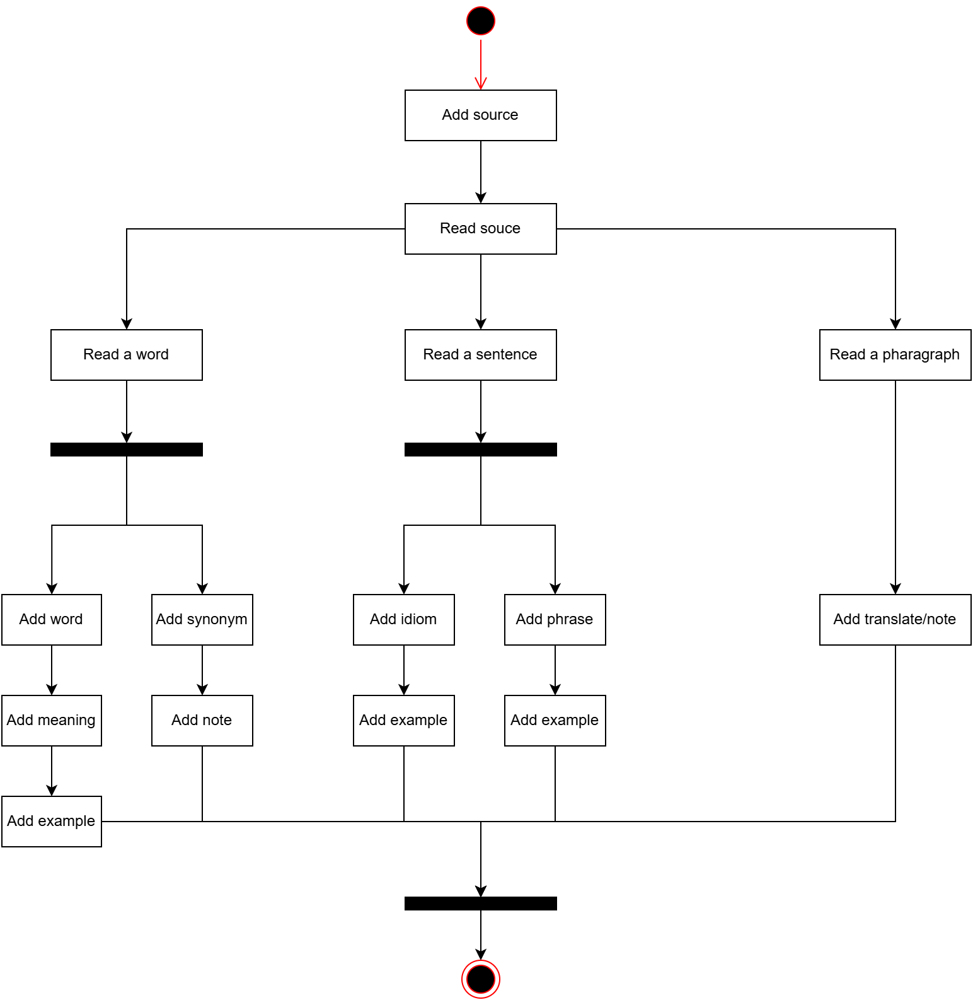

# An key idea for learning english is knowing about words

When people reading papers, watching movies, listening to a song they sometimes noticed a word that they are not familiar and wondering what is the meaning of that word...

Project ELP aims to create a simple platform for easily storing user's learning materials like new words, fun idioms or phrase. User can store a source (a short paragraph) and reading from it to extract new words to learn.

# 1. Activity Diagram

# 2. UI design

# 3. Application preview